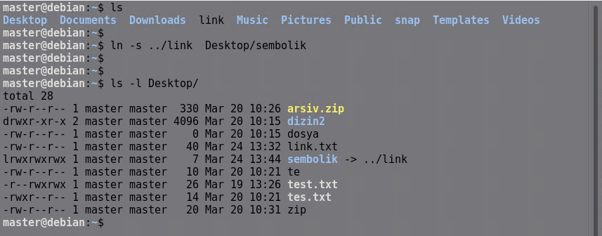
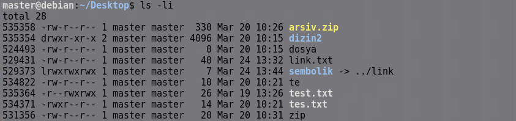
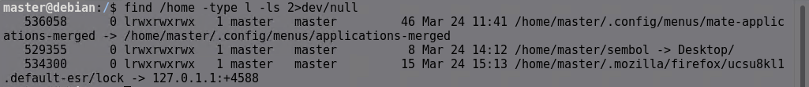
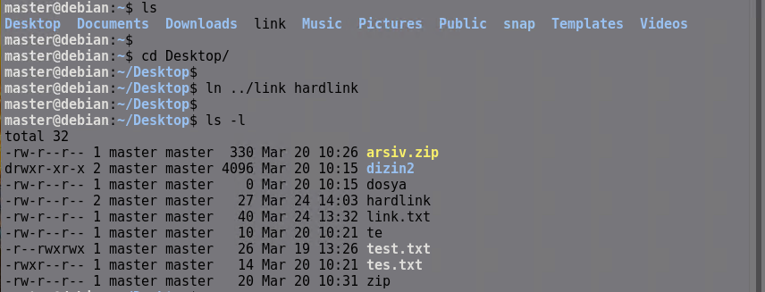
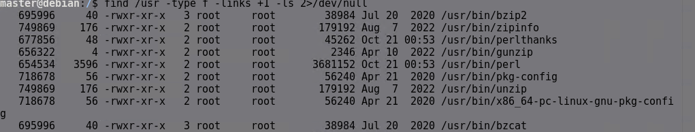

# Linux'ta Link (Bağlantı) Kavramı

Linux'ta **link (bağlantı)** kavramı, bir dosyayı veya dizini farklı bir ad veya konum altında erişilebilir kılmak için kullanılan bir mekanizmadır. Linux'ta iki tür bağlantı vardır:

1. **Symbolic Link (Sembolik Bağlantı veya Soft Link)**  
2. **Hard Link (Sert Bağlantı)** 

##  1. Symbolic Link (Sembolik Bağlantı / Soft Link)
- Windows'taki "Kısayol" mantığına benzer.  
- Orijinal dosyanın veya dizinin yolunu saklayan bir referans dosyadır.  
- Hard link'in aksine, farklı dosya sistemlerinde de oluşturulabilir.  
- Orijinal dosya silinirse symbolic link çalışmaz (çünkü sadece bir referanstır).  

### **Symbolic Link Nasıl Oluşturulur?**  
```bash
ln -s orijinal_dosya symbolic_link
```



Bu, **link** için **sembolik** adında bir sembolik bağlantı oluşturur.

Aşağıdaki komut ile nesnelerin inode numaralarıda gözlemlenebilir. inode numarası, dosyanın sistem içindeki kimliğidir ama içindeki rakamlar doğrudan dosya hakkında bir anlam taşımaz.

```bash
ls -li
```



Sembolik link ile link oluşturmalarda link ile asıl dosyanın inodaları farklı olur.


```
ln -sf yeni_hedef mevcut_link
```
Komutu ile sembolik linki yeni bir dosyaya yönlendirebilirsiniz.


---

```
find <aranacak konum> -type l -ls 
```
bu komut ile sembölik linkler görüntülenebilir.



## 2. Hard Link (Sert Bağlantı)
- Aynı dosyanın farklı adlarla erişilebilen kopyalarını oluşturur.  
- Gerçek dosya ile bağlantı arasında fark yoktur; yani biri silinse bile diğer bağlantılar çalışmaya devam eder.  
- Yalnızca aynı dosya sistemi içinde kullanılabilir.  
- Orijinal dosya silinse bile hard link'ler çalışmaya devam eder. 

### **Hard Link Nasıl Oluşturulur?**  
```bash
ln orijinal_dosya hard_link
```



Bu komut, **link** için **hardlink** adında bir sert bağlantı oluşturur.  

Hard link’ler aynı inode numarasını paylaşır, çünkü aynı fiziksel dosyayı gösterirler.


```
find <aranacak konum> -type f -links +1 -ls 
```
bu komut ile hard linkler görüntülenebilir.



---

```
find <aranacak konum> -inum <aranacak inode umarası >
```
bu komut ile hard linkler görüntülenebilir.


---

## 🔍 Özetle:
| Tür | Dosya Sistemleri Arası Kullanım | Orijinal Silinirse? | Performans | Kullanım Alanı | Inode ID |
|------|-----------------|-----------------|------------|--------------|-----------|
| **Hard Link** | Hayır | Dosya kalır | Daha hızlı | Aynı dosya içinde çoklu erişim | Aynı inode |
| **Symbolic Link** | Evet | Bağlantı bozulur | Biraz daha yavaş | Kısayol oluşturma, dizin bağlama | Farklı inode |

Eğer amacınız **kısayol oluşturmak** veya **farklı dosya sistemlerinde çalışmaksa**, **symbolic link** kullanmalısınız. Ama **aynı dosya sisteminde birden fazla isimle erişilebilir bir kopya oluşturmak** istiyorsanız, **hard link** tercih edebilirsiniz. 🚀